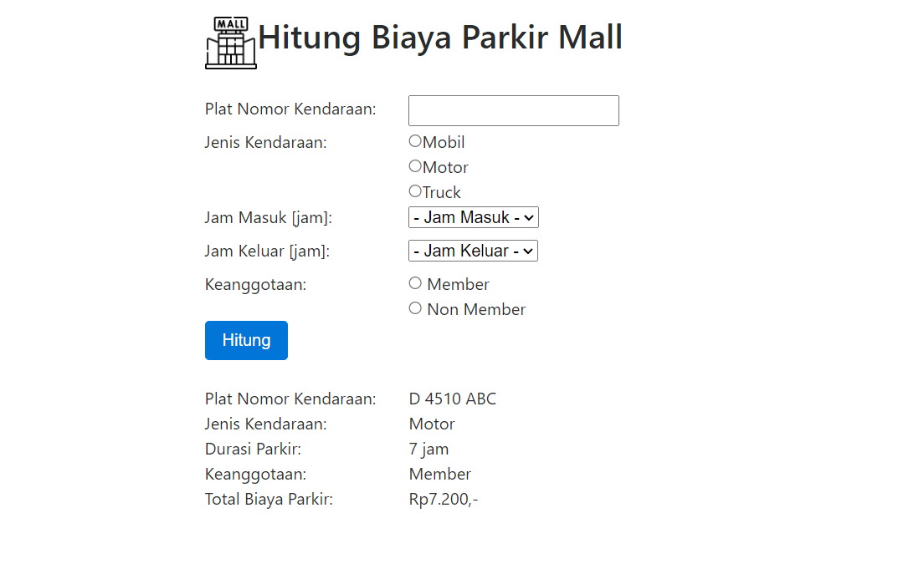

# Program PHP

## Menghitung Biaya Parkir Mall

## Features

- Menghitung biaya parkir saat jam masuk dan keluar
- Memiliki pilihan Member dan Non-Member
- Terdapat perbedaan perhitungan setelah jam pertama
- Dapat disimpan ke database

## Cara Penginstallan

- Buka code Editor yang akan digunakan
- Jalankan Server lokal
- Ekstrak file yang sudah di unduh
- buka localhost pada browser

## Source Code ini dibuat dengan

## Contoh Program Saat Dijalankan

